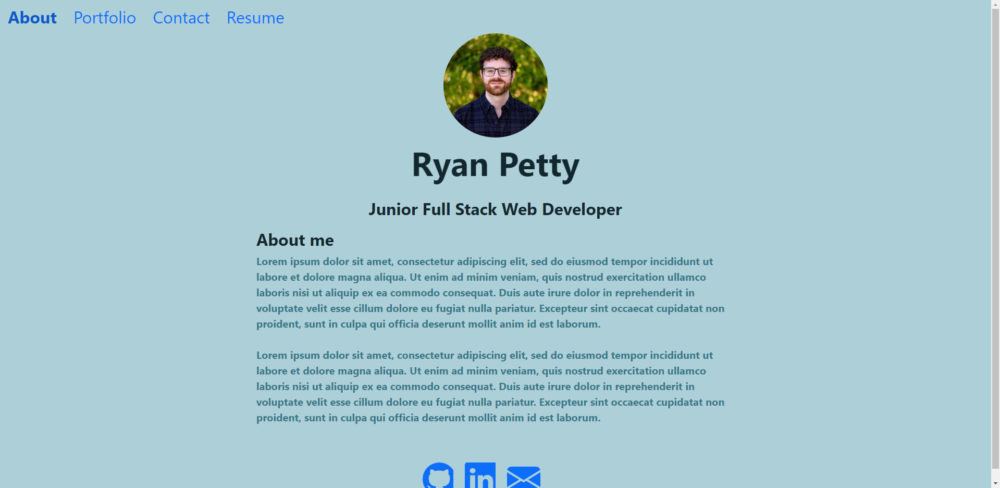

# React Portfolio

## Table of Contents

- [Description](#description)
- [Installation](#installation)
- [Screenshot](#screenshot)
- [Deployed](#deployed)
- [Usage](#usage)
- [Licenses](#license)
- [Questions](#questions)
- [Credits](#credits)

## Description

This is a single page application built with React that renders content for a professional portfolio, including an "About", "Contact", "Project", and "Resume" page.

## Installation

- In order to install, be sure to clone repository to local machine and in the terminal use `npm start` to start the server.

## Screenshot

## Deployed

This application is deployed

## Usage

This app allows users to view the about page, view my project, complete a contact form, and view my resume.

## Licenses

This project is covered under the MIT license. click the license button at the top to learn more.

https://opensource.org/licenses/MIT

## Questions

Questions regarding this project?
GitHub: https://github.com/Ryebread5555
Email: rypetty55@gmail.com

## Credits

- React
- JavaScript
- NodeJS
- Bootstrap
